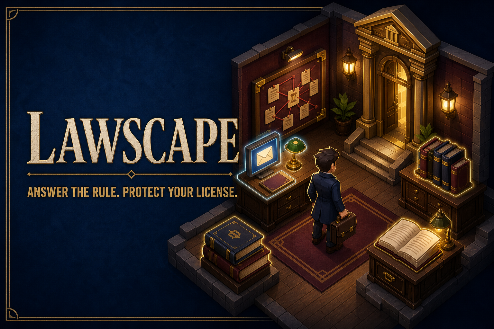

# LawScape



**Answer the rule. Build your practice. Protect your license.**

LawScape is a free, old-school browser RPG about legal ethics. Create an
attorney, explore an isometric law office and apartment, answer professional
responsibility dilemmas in BarMail, earn gold, and improve your practice
without losing your license.

The game is plain HTML, CSS, and JavaScript. It has no account, backend,
tracking, external assets, or runtime dependencies.

## Play now

Double-click [`index.html`](index.html). It launches directly in a modern
browser—no installation or local server is required.

Controls:

- **Mouse or touch:** click/tap a floor tile to walk; select people and objects
  to interact.
- **Keyboard:** use WASD or arrow keys to move.
- **Shortcuts:** B opens BarMail, R opens your record, T opens travel, H opens
  help, and Escape closes the current window.

Your progress is stored only in that browser.

## What is playable

- 21 legal-ethics scenarios involving trust accounting, conflicts, candor,
  confidentiality, the no-contact rule, solicitation, fee splitting,
  spoliation, and reporting misconduct.
- Character creation with appearance options.
- An explorable law office and apartment.
- Gold, Ethics health, answer streaks, rest, upgrades, and persistent saves.
- A professional record, NPC conversations, travel, minimap, and responsive
  desktop/mobile controls.
- Disbarment at zero Ethics, which resets the saved game.

The courthouse is intentionally closed in this edition. Court simulation is a
future feature described in [ROADMAP.md](ROADMAP.md).

## Run the developer preview

Node.js 22 or later is needed only for development:

```sh
npm start
```

Open `http://127.0.0.1:8000`.

After editing a source module under `js/`, refresh the direct-launch browser
bundle and run the checks:

```sh
npm run build
npm test
```

`js/lawscape.bundle.js` is generated and committed so players can open the game
from disk. Edit the source modules rather than the bundle.

## Publish on GitHub Pages

The repository includes automated validation and GitHub Pages workflows.

1. Create a GitHub repository and push the `main` branch.
2. In the repository, open **Settings → Pages**.
3. Set **Source** to **GitHub Actions**.
4. Run **Deploy LawScape to GitHub Pages** from the Actions tab, or push a
   commit to `main`.

The workflow builds a small `dist/` package containing only the playable site.

## Project structure

```text
index.html                 Browser entry point
css/style.css              Responsive game interface
js/main.js                 Game flow and interactions
js/data/                   Ethics scenarios and upgrades
js/engine/                 Isometric rendering and pathfinding
js/entities/               Player and NPC actors
js/ui/                     HUD and dialogue
js/world/                  Zones and interactive props
scripts/                   Zero-dependency build, checks, and preview server
tests/                     Node test suite
```

See [CONTRIBUTING.md](CONTRIBUTING.md) for contribution guidelines and
[SECURITY.md](SECURITY.md) for the project’s security model.

Local authoring corpora and packaged ethics-agent archives are intentionally
excluded from the public repository. The playable scenario data and rule
references needed by the game are contained in `js/data/ethics.js`.

## Educational disclaimer

LawScape is fictional educational software. It is not legal advice and does not
create an attorney-client relationship. Rule citations and explanations are
simplified for gameplay. Always consult the operative law and rules in the
relevant jurisdiction.

## License

MIT — see [LICENSE](LICENSE).
