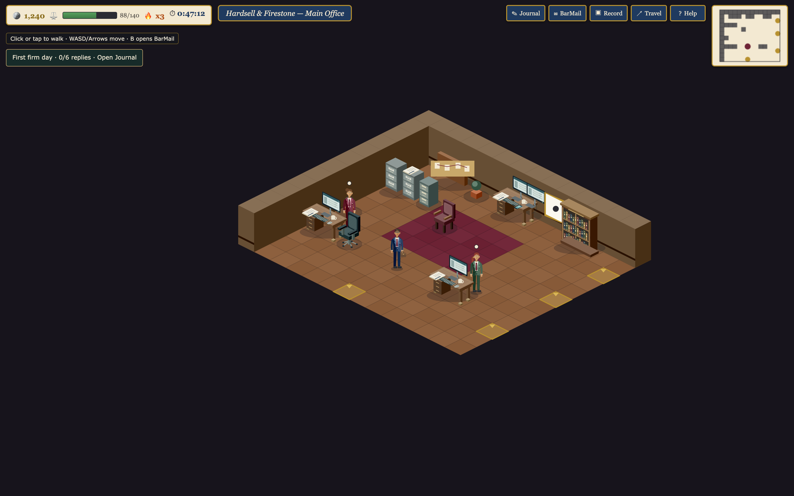

# LawScape

**[Play LawScape in your browser](https://joelakaufmann-lgtm.github.io/lawscape/)** · [How to play](docs/PLAYING.md) · [Jurisdictions](docs/JURISDICTIONS.md)

Build a legal career at Hardsell & Firestone, where the partners need answers,
the printer needs attention, and HR has been temporarily unstaffed since 1987.
Create an attorney, answer workplace dilemmas, inspect case files, earn gold
and improve your office while protecting your Ethics.

Free to play. No account, installation or API key required. The current release
is **0.6.0**, with the expanded avatar creator, all seven locations, and California
and New York practice. Prefer a quick look first? [Watch the 30-second demo](media/lawscape-demo-30s.mp4).

## Your first five minutes

1. Choose **Create an Attorney**, customize your character and enter the firm.
2. Open **Journal** for a guided first assignment, or **BarMail** at your office
   computer for a quick ethics question.
3. Open a subject line, read the facts, choose your response and read the
   explanation. In writing assignments, review the supplied file before replying.
4. Use **Journal → Firm jurisdictions** to choose a question pack. Each pack
   opens directly in BarMail; **Mixed practice** draws from all five.
5. Explore with **Travel**, talk to the partners, visit The Sidebar, and use
   **Journal → Wardrobe** to change your look. Gold buys accessories and upgrades.

Click or tap to walk and interact. WASD and arrow keys also move your attorney.
The Work Phone upgrade lets you use BarMail outside the office.

## Jurisdictions and practice

| Question pack | Questions | What you practice |
| --- | ---: | --- |
| California | 20 | California professional responsibility |
| New York | 33 | 28 workplace emails and five short dilemmas |
| US MPRE-style | 69 | Model-rule and exam-style study |
| England & Wales SQE-style | 28 | Ethics in England and Wales |
| LawScape original dilemmas | 21 | Fictional office dilemmas with mixed Arizona/Nevada rule labels |

**171 questions total.** The inbox shows your current difficulty tier, so you
will not see every question at once. Every original question remains included.

The fictional **State of Juris apprenticeship** adds six writing assignments,
two synthetic document files and one connected capstone. These activities are
separate from the question count. Canada and full jurisdiction-specific firm
curricula remain planned. [See coverage, sources and review status](docs/JURISDICTIONS.md).

## Before you start

Progress saves in this browser, without cross-device sync. Clearing browser
storage loses the save. Wrong ethics answers damage Ethics; reaching zero ends
the character run and resets its gold, upgrades and drafts. Correct streaks and
rest help restore Ethics.

The fictional apprenticeship awards study gold without Ethics damage. Its
checklist choices receive authored feedback; your written prose is saved for
self-comparison, not graded by live AI. Sidebar notes are local. Shared chat,
multiplayer and live courtroom hearings are future work.

LawScape is unofficial educational practice, not legal advice or official bar
exam content. Read the jurisdiction and source note on each question.

## Find more

- [Player guide](docs/PLAYING.md) — controls, activities, saves and consequences.
- [Report a bug](https://github.com/joelakaufmann-lgtm/lawscape/issues) — or use **Email HR · Report a bug** in BarMail.
- [Contribute](CONTRIBUTING.md), [roadmap](ROADMAP.md) and [release changes](CHANGELOG.md).
- [Documentation index](docs/README.md) — sources and maintainer instructions.

Code is distributed under the [MIT License](LICENSE).
